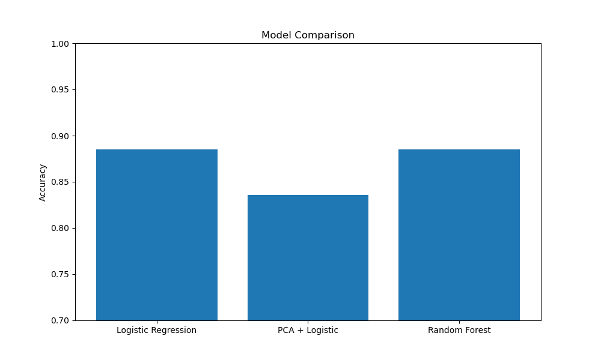
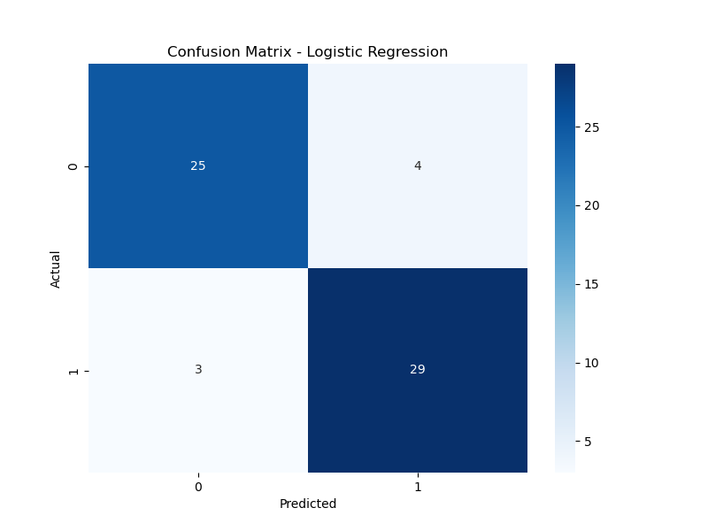

# Cardiovascular Disease Prediction

## Project Overview
This machine learning model predicts patients at risk for cardiovascular disease (CVD). CVDs are the leading cause of death in the United States, making early detection critical for prevention and intervention. This project explores different ML approaches to identify at-risk patients from clinical measurements.

## Dataset
- **Source:** UCI Heart Disease Dataset
- **Size:** 303 patients
- **Features:** 13 clinical measurements including age, blood pressure, cholesterol, and ECG results
- **Target:** Binary classification (disease vs. no disease)

## Methods
1. **Data Cleaning & Preprocessing**
   - Handled missing values (replaced with mean)
   - Converted all features to numeric format
   - Created binary target variable (0 = healthy, 1 = disease)

2. **Feature Engineering**
   - Applied PCA (Principal Component Analysis) to reduce dimensionality from 13 to 5 components
   - Compared performance with and without dimensionality reduction

3. **Models Tested**
   - Logistic Regression (baseline)
   - Logistic Regression with PCA
   - Random Forest Classifier

## Results
- **Best Accuracy:** 88.5% (Logistic Regression & Random Forest)
- **Best Accuracy:** 88.5% (Logistic Regression & Random Forest)
- **PCA Accuracy:** 83.6% (dimensionality reduction decreased performance, suggesting all 13 features contain valuable information)

### Model Comparison


### Confusion Matrix  



### Model Performance Analysis
The confusion matrix revealed:
- 54 out of 61 test cases correctly classified
- 3 false negatives (missed disease cases) - a concern for clinical application
- 4 false positives (false alarms)

While 88.5% is strong for a first model, it's not high enough for real-world deployment. The 3 missed disease cases highlight the need for improved sensitivity, as failing to detect disease could have serious consequences.

## Technologies Used
- **Python 3.13**
- **pandas** - data manipulation
- **numpy** - numerical operations
- **scikit-learn** - machine learning models and evaluation
- **matplotlib** - visualization
- **seaborn** - statistical visualization

## Key Learnings
- PCA doesn't always improve performance - sometimes reducing features loses critical information
- For medical applications, minimizing false negatives (missed cases) is more important than overall accuracy
- Logistic regression can perform as well as more complex models like Random Forest on smaller datasets

## Future Improvements
1. **Collect more data** - A larger, more robust dataset could improve model accuracy and generalization
2. **Adjust decision threshold** - Prioritize sensitivity to reduce false negatives
3. **Feature importance analysis** - Identify which clinical measurements are most predictive
4. **Explore advanced models** - XGBoost, Neural Networks
5. **Apply to cardiotoxicity prediction** - Extend this work to predict heart damage from cancer treatments

## How to Run
```bash
# Clone the repository
git clone [your-repo-url]

# Navigate to project directory
cd cardiovascular-disease-prediction

# Create virtual environment
python3 -m venv venv
source venv/bin/activate

# Install dependencies
pip install pandas numpy scikit-learn matplotlib seaborn

# Run the model
python3 model.py
```

Author: 
Tomi - Biomedical Engineering Master's Student
Interested in computational biology, precision medicine, and cardiovascular health

Note: This is an educational project and should not be used for actual medical diagnosis.